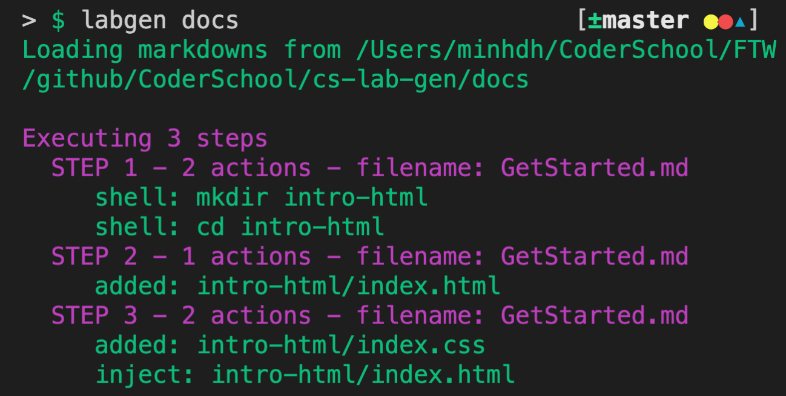

# A simple HTML Page

## Prepare the docs

Let's say we have a docs folder with this structure:

```
|- docs/
    |- Initialization.md
    |- CreateHTML.md
    |- CreateCSS.md
```

**In `Initialization.md`:**

````
# Initialization

## Step 1

Let's create a folder for our project called `intro-html`, and move to that folder.

```
---
sh: mkdir intro-html
---
```

```
---
sh: cd intro-html
---
```

````

> There are two actions here in step 1. They are running shell commands, so the body is not required.

**In `CreateHTML.md`:**

````
# Create the index.html

## Step 2

Let's create a file called `index.html` that has a `h1` tag in the body:

```html
---
to: intro-html/index.html
---

<!DOCTYPE html>
<html lang="en">
  <head>
    <meta charset="UTF-8" />
    <title>Intro to labgen</title>
  </head>
  <body>
    <h1>Hello labgen</h1>
  </body>
</html>
```

````

> Step 2 is defined here; the number 2 will ensure execution after step 1.

**In `CreateCSS.md`:**

````
# Create the index.css

## Step 3

Let's create a file called `index.css` that contains the rule to make all h1 title to be red.

```css
---
to: intro-html/index.css
---

h1 {
  color: red;
}
```

Then we have to link `index.css` to `index.html` by adding a `link` tag to the header of the HTML document. Let's put the `<link>` tag below under the tag `<title>`

```html
---
to: intro-html/index.html
inject: true
after: <title>
---

<link rel="stylesheet" href="index.css">
````

> Step 3 contains two actions with a description in the middle of the actions. The second action will inject into the `index.html` (`inject: true`) and add the body after/under the located line that defines the title of the HTML doc (`after: <title>`). The property `after` accepts regular expression to find the located line.

## Generate the project

Now, on the folder that contains `docs/`, let's run:

```bash
labgen ./docs
```

You will see



So `labgen` has recognized 3 steps and 5 actions and executed them successfully. In the same level of the folder `docs`, a new folder called `intro-html` has been created:

```
|- intro-html
    |- index.html
    |- index.css
```

Let's double-check the contents of `index.html` and `index.css`. They should look like this:

**In `index.html`**

```html
<!DOCTYPE html>
<html lang="en">
  <head>
    <meta charset="UTF-8" />
    <title>Intro to labgen</title>
    <link rel="stylesheet" href="index.css" />
  </head>
  <body>
    <h1>Hello labgen</h1>
  </body>
</html>
```

**In `index.css`**

```css
h1 {
  color: red;
}
```

Run the `index.html` with Live Server, you will see `Hello labgen` in red.


