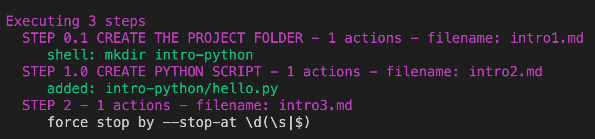
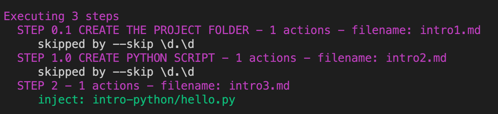

# Command-line parameters

This is the list of command-line parameters that you can use with `labgen`:

### Version

`labgen -v` or `labgen --version` gives you the info of the current version.

### Allow Shell Failure

`labgen ./path_to_docs -a` or `labgen ./path_to_docs --allow-shell-failure` will continue running even if a shell command execution unsuccessful. It is helpful when you don't want to delete the generated app folder every time you test the doc. Example `create-react-app` will fail if the folder exists, but it's ok because you don't want to generate that folder again.

### Export steps as JSON

`labgen ./path_to_docs --output-steps` will save list of steps in the file `output_steps.json`for debugging purpose. Example JSON:

```json
[
  {
    "title": "STEP 0.1 CREATE THE PROJECT FOLDER",
    "actions": [
      {
        "attributes": {
          "sh": "mkdir intro-python"
        },
        "body": "",
        "bodyBegin": 4,
        "frontmatter": "sh: mkdir intro-python"
      }
    ],
    "fileName": "/Users/minhdh/CoderSchool/FTW/github/CoderSchool/cs-lab-gen/test/docs/intro1.md"
  },
  {
    "title": "STEP 1.0 CREATE PYTHON SCRIPT",
    "actions": [
      {
        "attributes": {
          "to": "intro-python/hello.py"
        },
        "body": "print(\"Hello World\")\n",
        "bodyBegin": 5,
        "frontmatter": "to: intro-python/hello.py"
      }
    ],
    "fileName": "/Users/minhdh/CoderSchool/FTW/github/CoderSchool/cs-lab-gen/test/docs/intro2.md"
  },
  {
    "title": "STEP 2",
    "actions": [
      {
        "attributes": {
          "to": "intro-python/hello.py",
          "inject": true,
          "after": "Hello World"
        },
        "body": "print(\"Hello CoderSchool\")\n",
        "bodyBegin": 7,
        "frontmatter": "to: intro-python/hello.py\ninject: true\nafter: \"Hello World\""
      }
    ],
    "fileName": "/Users/minhdh/CoderSchool/FTW/github/CoderSchool/cs-lab-gen/test/docs/intro3.md"
  }
]
```

### Stop at

Using `--stop-at` allows you to stop at a certain step. Example

`labgen ./path_to_docs --stop-at 1\.0`

Will force `labgen` to stop when it's found a step whose title starts with `Step 1.0`. `--stop-at` takes a regex to determine to step to stop.

`labgen ./test/docs --stop-at "\d(\s|$)"`



### Skip

Sometimes you don't want to re-run a step which is time consuming and unnecessary, e.g. `npx create-react-app`. You can use the option `--skip` follow by a regex to determine the steps to be skipped. Example:

`labgen ./test/docs --skip "\d.\d"`


