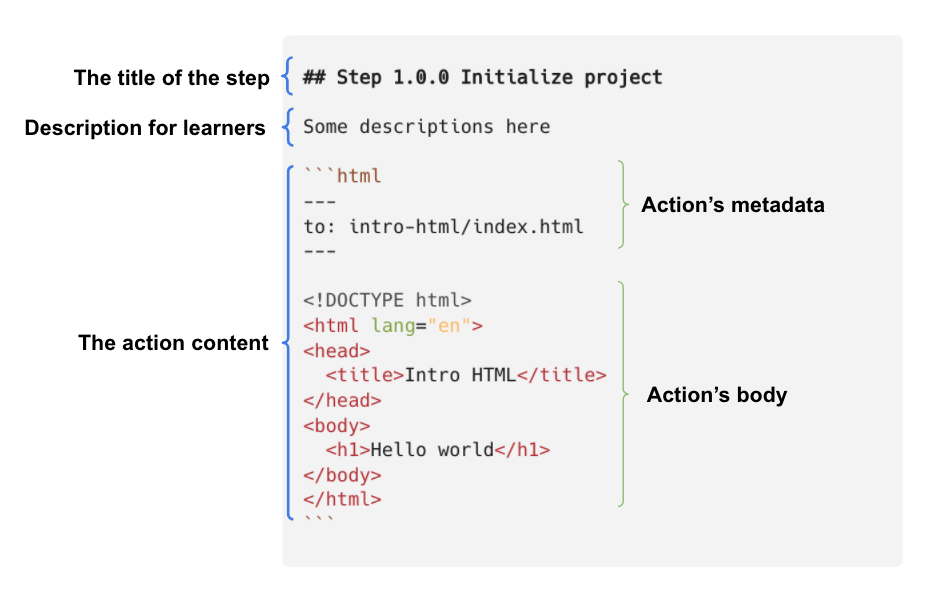
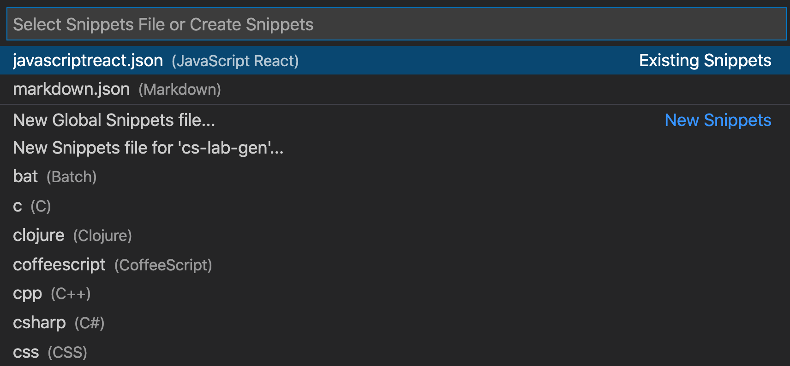

# Getting Started

CoderSchool's `labgen` is a tool for building the app from step-by-step markdown instructions.

## Installation

To install the package, create a `.npmrc` file in your current working folder:

```
@coderschool:registry=https://npm.pkg.github.com
```

Then on the terminal:

```bash
npm i @coderschool/cs-lab-gen
```

And test it with:

```bash
labgen -v
```

You should see the lastest version, e.g. `1.0.1`.

## Bootstrapping the project

After completing the instructions, have a `./docs` folder that contains markdown files in different sub-folders. You can run:

```bash
labgen ./docs
```

`labgen` takes the first parameters as the path to the document folder (in this case, `./docs`) and finds all markdown files recursively inside it.

Then `labgen` will extract a list of steps from the markdown files. A step is defined as markdown text with the following form:



- The title must be a markdown title (defined by 1 to 6 hashtags `#`), and start with the word **step** (case insensitive). **The steps will be sorted by the titles**, so the step order should follow right after the word step, e.g. 1.1, 1.2, 1.0.1, 1.0.2, etc.

- The description is for learners to understand the step and optional to `labgen`.

- The action content is the main thing `labgen` cares about. The action should start with the markdown code block \```. It contains two main parts:

  - The metadata is defined by two `---` lines (markdown-like [frontmatter](https://www.npmjs.com/package/front-matter)). It describes the action behavior like creating a new file, injecting to a file, running a shell command, etc.
  - The body is whatever below the metadata. It defines the code to add/inject to a file. The body is ignored if running a shell command or removing lines from a file.

- **A step can have many actions**

## VSCode labgen snippets

You can define some code snippets to save times typing actions.

- On VSCode, `Cmd + Shift + P`, type `snippets`, select **Preferences: Configure User Snippets**
- You will see a list of snippets files. They are written in JSON
  
- Let's open/create `markdown.json`, then put these snippets in:

````json
"labgen addition action": {
    "prefix": "lgadd",
    "body": ["```javascript\n---\nto: $1\n---\n$2\n```"],
    "description": "create addition action of labgen"
  },
"labgen inject action": {
  "prefix": "lginj",
  "body": ["```javascript\n---\nto: $1\ninject: true\nafter: $2\n---\n$3\n```"],
  "description": "create injection action of labgen"
},
"labgen remove lines action": {
  "prefix": "lgrm",
  "body": ["```javascript\n---\nto: $1\ninject: true\nremove_lines:\n  from: $2\n  to: $3\n---\n```"],
  "description": "create remove lines action of labgen"
}
````

- The key "labgen ..." is the snippet name. It is displayed via IntelliSense if no description is provided.
- `prefix` defines one or more trigger words that display the snippet in IntelliSense.
- `body` is one or more lines of content, which will be joined as multiple lines upon insertion. Newlines and embedded tabs will be formatted according to the context in which the snippet is inserted.
- `description` is an optional description of the snippet displayed by IntelliSense.

Now in your markdown instruction file, you can type `lgadd` and `Tab`, here you go.

````
```bash
---
to:
---

```
````
